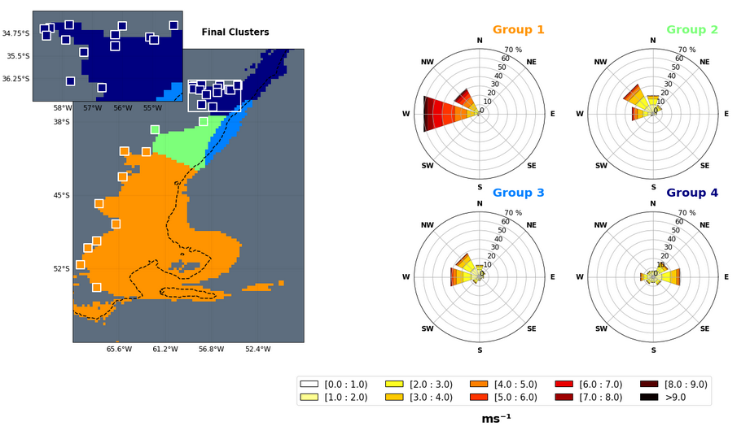
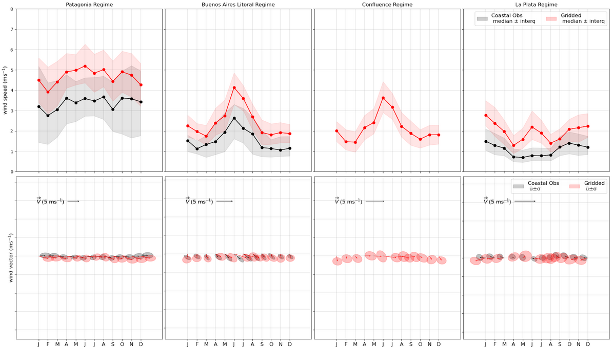
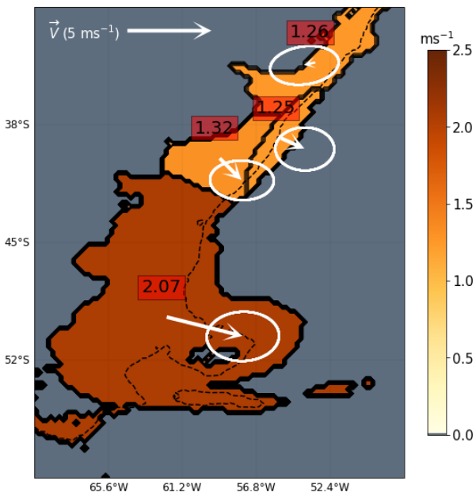
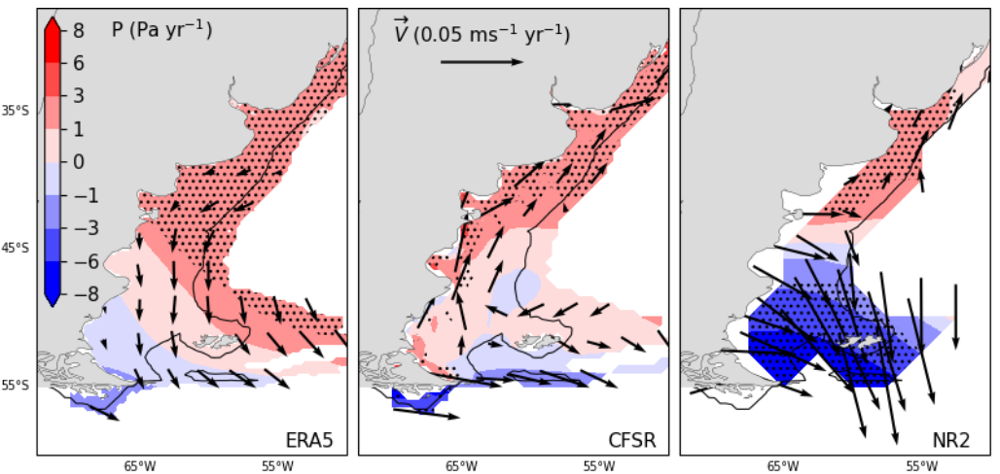
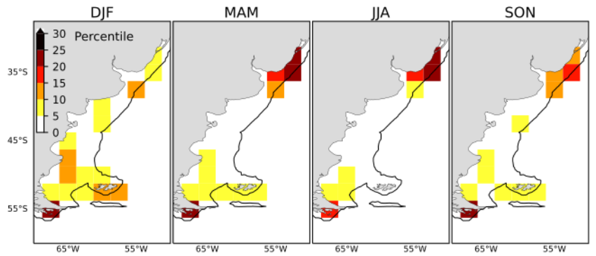
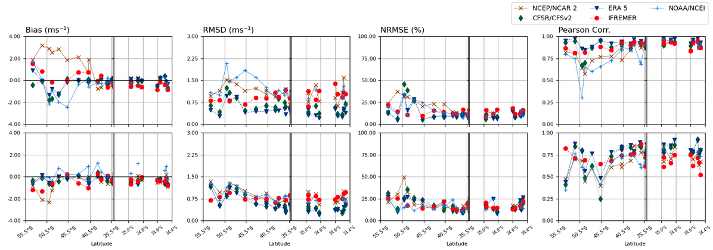
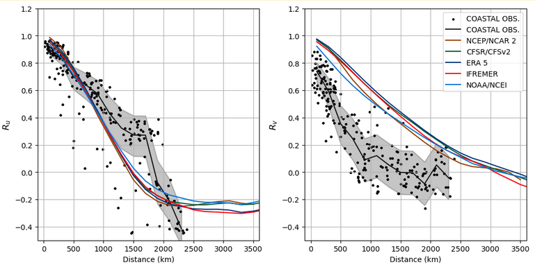

> Este trabajo explora la circulación superficial del viento sobre la Plataforma Continental del Atlántico Sudoccidental (SWACS) en el período 1991-2020, usando datos de reanálisis, satélites y observaciones costeras. Aplicamos un enfoque estadístico de clustering para regionalizar y describir patrones, estacionalidad, tendencias y diferencias entre productos.

## Cuatro regímenes de viento sobre la plataforma

A través de un método de clustering jerárquico, se identificaron cuatro grandes regímenes de viento:

- **Patagónico**: vientos del oeste/noroeste, intensos y persistentes.
- **Buenos Aires**: noroestes estacionales, con alta variabilidad.
- **Confluencia**: zona de transición afectada por interacciones oceanográficas.
- **La Plata**: dominado por vientos del este/noreste, estacionales y más suaves.

## Estacionalidad y variabilidad del viento

Cada región muestra un ciclo estacional distinto:
- En Patagonia, el viento es más fuerte en invierno.
- En Buenos Aires y Confluencia hay una estacionalidad marcada, con noroestes en invierno.
- En La Plata se alternan easterlies en verano y westerlies en invierno.

La descomposición de varianza revela que:
- Patagonia está dominada por escalas subanuales y estacionales.
- La Plata muestra alta variabilidad subanual.
- La componente meridional pierde coherencia espacial a partir de 200 km.

## Tendencias de largo plazo

Durante los últimos 30 años:
- Se debilitaron los vientos en Patagonia.
- Se reforzó el gradiente de presión sobre La Plata.
- La región de Confluencia no muestra tendencias significativas.

## Diferencias entre datasets

La comparación entre reanálisis y satélites revela grandes diferencias cerca de la costa, especialmente:
- En invierno sobre el Río de la Plata.
- En verano y primavera en Patagonia.

Estas diferencias se relacionan con la resolución costera, la asimilación de datos y las limitaciones de los satélites cerca del litoral.

## Validación costera

La comparación con observaciones de estaciones meteorológicas muestra:
- Sobreestimación en mar abierto.
- Subestimación en el estuario.
- Mejor representación de la componente zonal (u).

## ↔ Coherencia espacial

- El viento zonal mantiene coherencia hasta 1000 km.
- El viento meridional pierde coherencia a los 200 km.

## Agradecimientos

Este trabajo fue posible gracias a la formación y el acompañamiento de **Claudia Simionato, Carolina Vera y Matías Dinapoli**, quienes participaron en su etapa inicial. Agradezco también al **CIMA, SMN y a las instituciones** que mantienen operativos los datasets utilizados.

---

🔗 El código, gráficos y figuras de este análisis están disponibles bajo pedido. Este post busca compartir una mirada climática y regional sobre el viento, sus patrones y sus impactos sobre la circulación costera del Mar Argentino.
